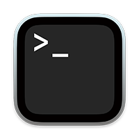

# Hacker Nerds
A Terminal-based game to learn UNIX-style file paths

## Open the Terminal
On the iMac, go to /Applications/Utilities/ and double-click the Terminal application. This opens a "console window", which is how computers were used before Apple launched the Macintosh - with a "Graphic User Interface", aka a Desktop, mouse and icons - back in 1984.

Because the Internet was invented before the Mac, a lot of ways about how the Web works is based on old school computing. 

## Basic CLI Commands
- `pwd`: **Preset Working Directory**. Displays the path to your current directory (aka "folder") location.
- `cd`: **Change Directory**. (Go from one folder to another)
- `cp`: **Copy**. Copies a file from location A to location B
- `cp -R`: **Recursive Copy**. Copy a folder and everything inside it too.
- `mv`: **Move**. Moves a file from location A to location B (or renames it in the same location)
- `pico`: A very simple command-line text editor (like a very simple Microsoft Word)
    - Move the cursor with the arrow keys.
    - control-o: Saves the changes made in pico.
    - control-x: Quits pico.
- `rm`: **Remove**. Deletes a file.
- `mkdir`: **Make Directory**. Creates an empty folder.
- `rmdir`: **Remove Directory**. Deletes an *empty* folder.
- `history`: Shows your recent terminal commands

## Game Setup

1. Download the compressed .zip folder from GitHub.

2. Unzip the file and move it to your Documents folder.
3. Within your Documents folder, you should now have a folder called "hacker-nerd".
4. Switch to the Terminal window.
5. Type `cd ` (the letters cd *followed by a space*) and then drag and drop the "hacker-nerd" folder onto the Terminal window.
6. Hit `Enter` on the keyboard. This will make the Terminal "go into" the hacker-nerd folder.

7. Note how the Terminal printed out the path to the hacker-nerds folder. Pay close attention to what that path means: 

    *"There is a 'hacker-nerd' folder inside the 'Documents' folder that is inside 'eric' inside the 'Users' folder which is located at the root level /"*.

    **Remember that concept!**

8. Type `pwd` and `Enter` to check that your current working directory matches the path seen in the window.

### Objective
The objective of the game to create a **working** three page web site using the given HTML template, CSS file and images. You will use commands to create folders, copy files and/or folders and edit the paths within the files to match up with the folders you created.

### Tips
#### Vocabulary

- Source: The file you are currently editing.
- Target: The file you want to link to from the source file.

### Shell Command-line Tips

- After each terminal command given in the instructions, you must hit `Enter` to execute the command.
- The console shell is smart enough to autocomplete file names. For example, if you start typing "hack" and then hit `Tab`, the shell will print out the full path `hacker-nerd/`. 
- For autocompletion to work, the letters typed so far must belong to a unique folder or file name. For example, if you had "hack.html" and a folder called "hacker-nerd", autocompletion won't know which one to use. Type the next character in the path you want (either "." or "e") and then hit `Tab` again. 

#### Links
`<a href="filename.html">`: Links directly to filename (both source and target files are at same level)

`<a href="foldername/filename.html">`: Links to target filename that is inside foldername (one level deeper)

`<a href="../filename.html">`: Links to target filename that is outside foldername (one level up)

`<a href="../../filename.html">`: Links to target filename that is outside foldername (two levels up)

`./`: Represents "here" (the folder you are currently working in)

## Start the Game: Level 1

Make sure you have a **Finder** window open that shows your Documents. As you play the game, you will be able to see the files and folders being created in real time. This will help you visualize what is happening during the game.

1. Create a folder called root outside of the "hacker-nerd" folder:

    `mkdir ../root`  `Enter`

2. Switch into the new root folder: 

    `cd ../root`  `Enter`

3. Type `pwd` to confirm that you did switch into the root folder:

    `pwd`  `Enter`

    You should see something like this: 
    `/Users/eric/Documents/root`

4. Copy the CSS and img folders (and their contents) from hacker-nerd to root: 

    `cp -R ../hacker-nerd/css ./`  `Enter`

    `cp -R ../hacker-nerd/img ./`  `Enter`

5. Copy the template HTML file from hacker-nerd into root, and at the same time, rename it to "index.html":

    `cp ../hacker-nerd/template.html ./index.html`  `Enter`

6. Open index.html with the pico text editor:

    `pico index.html`  `Enter`

7. Using the arrow keys, move the cursor to the \<title> tag. Delete (using the Backspace key to delete backwards, or the Delete key to delete forwards) the "Template File" text and replace it with "Hacker Nerd by Your Name". Scroll down and do the same for the \<h1> tag.

    Tip: In a console window the cursor block goes in front of what you want to edit.

8. Save the file using `control-o` (letter o, not zero). Hit `Enter`.

9. Switch to the macOS Finder and open the index.html file in your favourite browser.

10. Go back to nano. Find this line: `<a href="path-to-page.html">`

11. Change the path to `hackers/hacker-girl.html`

12. A few lines down, find this line: ``

13. Change the path to `img/hacker-nerd-anonymous.gif` and the alt text to "Anonymous hacker matrix animation".

14. Save the file using `control-o` (letter o, not zero). Hit `Enter`.

15. Quit pico using `control-x` (lowercase letter x). Hit `Enter`.

Switch to your browser and hit the `Refresh` button. Check to see if all the changes are visible.

## Level 2

Now that you have learned the basics, the levels get a little bit harder. Everything remains the same, but you will need to write the paths yourself.

1. Type `pwd` to confirm that you are still inside the root folder:

    `pwd`  `Enter`

    You should see something like this: 
    `/Users/eric/Documents/root`

2. In Step 11 of Level 1, we wrote a path to a folder and file we do not have. We will create them now.

    `mkdir` hackers `Enter`

    `cp ../hacker-nerd/template.html ./hackers/hacker-girl.html`

### Challenge 2.1
If you open the hacker-girl.html page in your browser, you will see that the background color does not show. The path to the CSS is broken. It is broken because the `<link rel="stylesheet" type="text/css" href="css/stylesheet.css">` path is written for an HTML page that is at the same level as the CSS folder. Our new page, hacker-girl.html, is in a subfolder. 

You must edit the path so that it **points one level up**, outside of hackers, back to the main level of root.

See the **Links** section above for help.

3. Open the file with `pico hackers/hacker-girl.html`

4. Modify the path.

5. Save the file using `control-o` (letter o, not zero). Hit `Enter`.

6. Go to your browser and hit `Refresh`.

7. If the background color appears, go to Step 8.

    If the background color does not appear, go back to the CSS path and fix the error.

8. Still in pico:
    - Change the \<title> "Template File" text to "Hacker Girl".
    - Change the \<h1> "Page Name" text to "Hacker Girl"
    - Change the "path-to-page.html" text to "hacker-boy/index.html"
    - Change the picture path to use "hacker-nerd-girl.jpg"

9. Save the file using `control-o` (letter o, not zero). Hit `Enter`.

10. Go to your browser and hit `Refresh`.

### Challenge 2.2
Open the hacker-girl.html page in your browser. Check the following:

- The background color shows.
- The jpeg image appears.
- The image is clickable and leads to a missing page.

Your challenge is to make sure the path to the image is correct. You must edit the path so that it **points one level up**, outside of hackers, back to the main level of root.