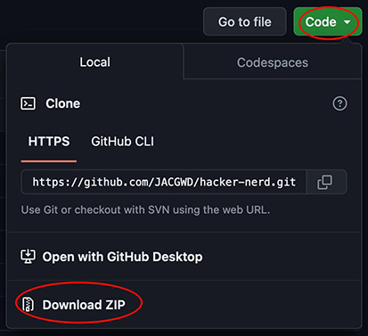
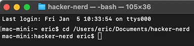

# Hacker Nerds
A Terminal-based game to learn UNIX-style file paths

## Open the Terminal
On the iMac, go to /Applications/Utilities/ and double-click the Terminal application. This opens a "console window", which is how computers were used before Apple launched the Macintosh - with a "Graphic User Interface", aka a Desktop, mouse and icons - back in 1984.

Because the Internet was invented before the Mac, a lot of ways about how the Web works is based on old school computing. 

## Basic CLI Commands
- `pwd`: **Preset Working Directory**. Displays the path to your current directory (aka "folder") location.
- `cd`: **Change Directory**. (Go from one folder to another)
- `cp`: **Copy**. Copies a file from location A to location B
- `cp -R`: **Recursive Copy**. Copy a folder and everything inside it too.
- `mv`: **Move**. Moves a file from location A to location B (or renames it in the same location)
- `pico`: A very simple command-line text editor (like a very simple Microsoft Word)
    - Move the cursor with the arrow keys.
    - control-o: Saves the changes made in pico.
    - control-x: Quits pico.
- `rm`: **Remove**. Deletes a file.
- `mkdir`: **Make Directory**. Creates an empty folder.
- `rmdir`: **Remove Directory**. Deletes an *empty* folder.
- `history`: Shows your recent terminal commands

## Game Setup

1. Download the compressed .zip folder from GitHub.

2. Unzip the file and move it to your Documents folder.
3. Within your Documents folder, you should now have a folder called "hacker-nerd".
4. Switch to the Terminal window.
5. Type `cd ` (the letters cd *followed by a space*) and then drag and drop the "hacker-nerd" folder onto the Terminal window.
6. Hit `Enter` on the keyboard. This will make the Terminal "go into" the hacker-nerd folder.

7. Note how the Terminal printed out the path to the hacker-nerds folder. Pay close attention to what that path means: 

    *"There is a 'hacker-nerd' folder inside the 'Documents' folder that is inside 'eric' inside the 'Users' folder which is located at the root level /"*.

    **Remember that concept!**

8. Type `pwd` and `Enter` to check that your current working directory matches the path seen in the window.

### Objective
The objective of the game to create a **working** three page web site using the given HTML template, CSS file and images. You will use commands to create folders, copy files and/or folders and edit the paths within the files to match up with the folders you created.

### Tips
#### Vocabulary

- Source: The file you are currently editing.
- Target: The file you want to link to from the source file.
- After each terminal command given in the instructions, you must hit `Enter` to execute the command.

#### Links
`<a href="filename.html">`: Links directly to filename (both source and target files are at same level)

`<a href="foldername/filename.html">`: Links to target filename that is inside foldername (one level deeper)

`<a href="../filename.html">`: Links to target filename that is outside foldername (one level up)

`<a href="../../filename.html">`: Links to target filename that is outside foldername (two levels up)

`./`: Represents "here" (the folder you are currently working in)

## Start the Game

Make sure you have a **Finder** window open that shows your Documents. As you play the game, you will be able to see the files and folders being created in real time. This will help you visualize what is happening during the game.

1. Create a folder called root outside of the "hacker-nerd" folder:

    `mkdir ../root`

2. Switch into the new root folder: 

    `cd ../root`

3. Type `pwd` to confirm that you did switch into the root folder:

    `/Users/eric/Documents/root`

4. Copy the CSS folder (and its contents) from hacker-nerd to root: 

    `cp -R ../hacker-nerd/css ./`